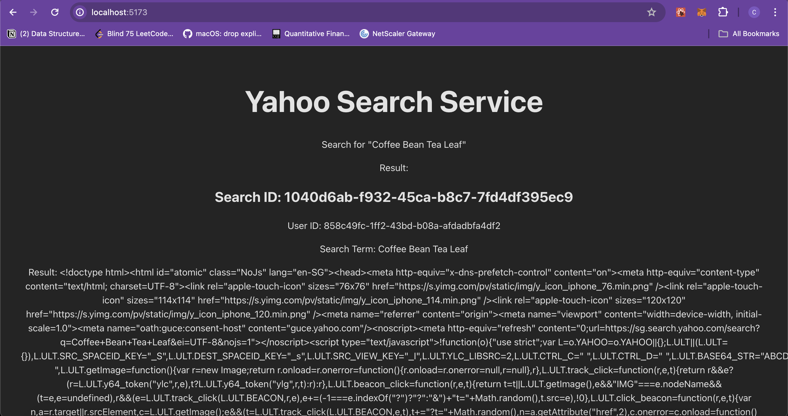

## Yahoo Search Engine UI

This React Front End Web Application aims to allow users to make searches to yahoo, and format the search results as a structured json

See the SERPER API UI

- We are replicating this
- https://serper.dev/?gad_source=1&gclid=CjwKCAjwr7ayBhAPEiwA6EIGxEPoI9psE9hAM0h1VHU7Gx8GNsnGjwF09NA9vrUAf4_JWkHId7uHjhoCwvoQAvD_BwE

## Installing dependencies

```
npm install
```

## Spinning up the server on DEV

```
npm run dev
```

## Building the UI into a `dist` (compiled, optimized javascript executable)

```
npm run build
```

## Adding environment variables to the project

Add it to `.env`. The project imports the environment variables with the `dotenv` package

Ensure environment variables have the `VITE_` prefix for vite to recognize them

On the server side, get the environment variables with `process.env.VITE_YAHOO_SEARCH_ENGINE_URL`

On client side rendered environment variables, get the environment variables with `import.meta.env.VITE_YAHOO_SEARCH_ENGINE_URL`

## Status



- [x] Implemented a YahooSearchService, responsible for querying the `yahoo_search_service` python backend
- [x] Simple page to show the results from yahoo search service
- [ ] Modify `yahoo_search_service` backend, to return the results processed by the ETL pipeline
- [ ] Make the UI realtime, while keeping the server lean

## Proposed Kafka Architecture Overview for Real-time extraction

- Crux of architecture: Avoid letting a single process write to both the database and Kafka to prevent partial failures. Implement the Outbox pattern, which uses dedicated processes to poll the database for updates and send Kafka updates separately

1. Yahoo Search Engine Service:
   Writes raw results to raw_results table.
   Subscribes to Kafka topic (extracted_results) for notifications when processed results are ready.
   Then, waits for the extracted_results topic to have a message indicating the extraction is complete

2. Raw Results Outbox Processor
   Monitors raw_results table for new entries.
   Publishes new entries to the Kafka topic (raw_results).

3. ETL Processor:
   Listens to the Kafka topic (raw_results).
   Processes messages and writes extracted results to extracted_search_results table.

4. Extracted Results Outbox Processor
   Listens to extracted_search_results table, and publishes to extracted_results

5. Yahoo Search Engine Service (Back to this)
   Listens to the Kafka topic (extracted_results).
   Notifies the yahoo_search_engine service when results are ready.
